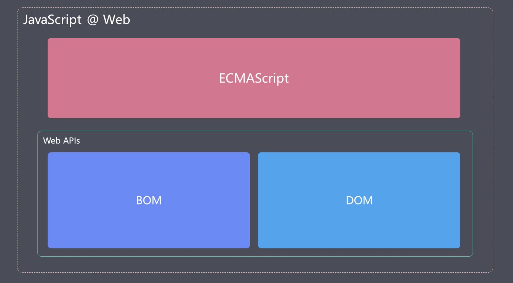
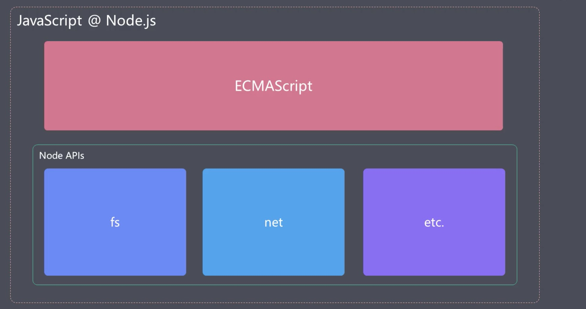

## es6泛指所有新特性，准确点说应该是es6+
web环境下，JavaScript = ECMAScript + Web APIS(BOM、DOM)

node环境下，JavaScript = ECMAScript + Node APIS(fs、net等)

### es5.1基础上的变化归纳为四类
- 解决原有语法的问题或不足
- 对原有语法进行增强，使其更便捷易用
> 例如：解构、展开、函数参数默认值、模版字符串等
- 全新的对象、全新的方法、全新的功能
> 例如：Promise、Proxy、Reflect等
- 全新的数据类型和数据结构
> 例如：Symbol、Set、Map等


#### es2015新特性
- let与块级作用域
- const
- 数组的解构
- 对象的解构
- 模版字符串
- 带标签的模版字符串
- 字符串的扩展方法
- 参数默认值
- 剩余参数
- 展开数组
- 箭头函数  
  - 箭头函数与this
- 对象字面量的增强
- Object.assign
- Objeect.is
- Proxy
  - proxy对比Object.defineProperty
- Reflect
- Promise
- class类
  - 静态方法
  - 类的继承
- Set
- Map
- Symbol
- for...of循环
- 可迭代接口
  - 实现可迭代接口
  - 迭代器模式
- 生成器generator
  - 生成器的应用
- ES Modules

模版字符串与普通字符串区别
1. 可以多行
2. 模板字符串中可以嵌入变量、函数调用，用于动态展示内容
3. 带标签的模版字符串
```javascript
  alert`hello`
  // 等同于
  alert(['hello'])
  const name = 'tom'
  const gender = true
  function myTagFun(strings, value1, value2) {
    console.log(strings, value1, value2)
    const sex = gender ? 'man' : 'woman'
    return strings[0] + name + strings[1] + sex + strings[2]
  }
  // 可以利用标签函数，提高用户的阅读，对数据进行更规范的处理，或者也可以文本的多元化（语言），甚至可以自定义一个小型的模板引擎
  const result = myTagFun`hey, ${name} is a ${gender}.`
```

字符串的扩展方法
1. includes()
2. startsWith()
3. endsWith()

箭头函数与普通函数的区别

1. 外形不同，箭头函数都是匿名函数，普通函数可以有匿名函数，也可以有具名函数。  
2. this的指向不同  
3. 箭头函数没有arguments内部属性  
4. 箭头函数不能使用new构造器来实例化  
5. 箭头函数不具有prototype属性(函数实例的prototype属性,只有该函数实例作为构造函数，用new实例话对象时，才有意义)  
6. call、bind、apply可以改变普通函数的this指向，但是对箭头函数无效     

#### ES2016新特性
- 数组实例对象的includes方法
- 指数运算符
#### ES2017新特性
- Object.values()
- Object.entries()
- Object.getOwnPropertyDescriptors()
- String.prototype.padStart/padEnd
- async/await