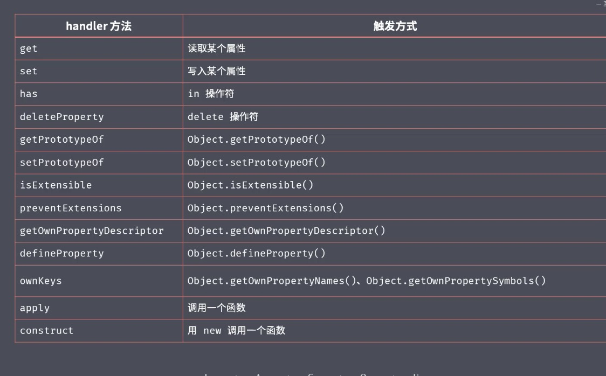

## es6泛指所有新特性，准确点说应该是es6+
web环境下，JavaScript = ECMAScript + Web APIS(BOM、DOM)

node环境下，JavaScript = ECMAScript + Node APIS(fs、net等)

### es5.1基础上的变化归纳为四类
- 解决原有语法的问题或不足
- 对原有语法进行增强，使其更便捷易用
> 例如：解构、展开、函数参数默认值、模版字符串等
- 全新的对象、全新的方法、全新的功能
> 例如：Promise、Proxy、Reflect等
- 全新的数据类型和数据结构
> 例如：Symbol、Set、Map等


#### es2015新特性
- let与块级作用域
- const
- 数组的解构
- 对象的解构
- 模版字符串
- 带标签的模版字符串
- 字符串的扩展方法
- 参数默认值
- 剩余参数
- 展开数组
- 箭头函数  
  - 箭头函数与this
- 对象字面量的增强
- Object.assign
- Objeect.is
- Proxy
  - proxy对比Object.defineProperty
- Reflect
- Promise
- class类
  - 静态方法
  - 类的继承
- Set
- Map
- Symbol
- for...of循环
- 可迭代接口
  - 实现可迭代接口
  - 迭代器模式
- 生成器generator
  - 生成器的应用
- ES Modules

模版字符串与普通字符串区别
1. 可以多行
2. 模板字符串中可以嵌入变量、函数调用，用于动态展示内容
3. 带标签的模版字符串
```javascript
  alert`hello`
  // 等同于
  alert(['hello'])
  const name = 'tom'
  const gender = true
  function myTagFun(strings, value1, value2) {
    console.log(strings, value1, value2)
    const sex = gender ? 'man' : 'woman'
    return strings[0] + name + strings[1] + sex + strings[2]
  }
  // 可以利用标签函数，提高用户的阅读，对数据进行更规范的处理，或者也可以文本的多元化（语言），甚至可以自定义一个小型的模板引擎
  const result = myTagFun`hey, ${name} is a ${gender}.`
```

字符串的扩展方法
1. includes()
2. startsWith()
3. endsWith()

箭头函数与普通函数的区别

1. 外形不同，箭头函数都是匿名函数，普通函数可以有匿名函数，也可以有具名函数。  
2. this的指向不同  
3. 箭头函数没有arguments内部属性  
4. 箭头函数不能使用new构造器来实例化  
5. 箭头函数不具有prototype属性(函数实例的prototype属性,只有该函数实例作为构造函数，用new实例话对象时，才有意义)  
6. call、bind、apply可以改变普通函数的this指向，但是对箭头函数无效     

对象字面量的增强
```javascript
  const bar = 'test'
  const obj = {
    // bar: bar,
    bar,
    //  method: function() {
    //    console.log('method111', this) // this就是obj本身
    //  },
    method() {
        console.log('method111', this) // this就是obj本身
    },
    [Math.random()]: '1111'
 }
 obj.method()
```

Object.is
```javascript
console.log(
  0 == false, // true
  0 === false, // false
  +0 === -0, // true
  NaN === NaN // false
)
Object.is(0, false) // false
Object.is(+0, -0) // false
Object.is(NaN, NaN) // true
```

Proxy 代理对象
> es5中监视数据的读写，使用Object.defineProperty
> vue2.x中就是使用的Object.defineProperty，完成数据的响应和双向绑定
> vue3.0实现数据响应式和双向绑定 使用改为Proxy
1. Object.defineProperty只能监听到读写操作
2. Proxy能够监听到更多对象操作（比如deleteProperty）

3. Proxy更好的支持数组对象的监视（之前监视数组的方式：重写数组的操作方法，在重写的方法内进行拦截劫持）
4. Proxy是以非侵入的方式监管了对象的读写
> Proxy内部对对象属性的操作方法，默认使用的是Reflect的操作api来实现的

Reflect
意义： 提供了一套统一的用于操作对象的API
```javascript
const obj = {
  name: 'karla',
  age: 18,
}
  console.log('name' in obj)
  console.log(delete obj['age'])
  console.log(Object.keys(obj))
  // 同上
  Reflect.has(obj, 'name')
  Reflect.deleteProperty(obj, 'age')
  Reflect.ownKeys(obj)
```
Symbol
1. 可以用来定义一个唯一标识符
```javascript
console.log(Symbol(1) === Symbol(1)) // false
```
2. 如果想要复用一个相同的Symbol值，可以使用Symbol.for()来定义
```javascript
console.log(Symbol.for(1) === Symbol.for(1)) // true
// Symbol.for方法的参数，如果不是字符串类型，会自动转化为字符串
```
3. Symbol中有些内置的Symbol常量，用来作为内部方法的标示，可以让自定义对象实现一些js当中内置的接口
```javascript
const obj = {}
console.log(obj.toString()) // 对象默认的toString标签是 [object Object]
// 自定义tostring的标签
const obj = {
  [Symbol.toStringTag]: 'XObject'
}
console.logobj.toString()) // 此时对象的toString标签是 [object XObject]
```
4. 获取对象中Symbol类型的属性名, 调用Object.getOwnPropertySymbols()可以获取对象中所有的Symbol属性名

for...of循环
以后会作为遍历所有数据结构的统一方式
可以使用break关键词随时跳出循环
arr.some()中返回true
arr.every()中返回false都可以终止遍历
arr.forEach()中不能跳出循环终止遍历
#### ES2016新特性
- 数组实例对象的includes方法
- 指数运算符
#### ES2017新特性
- Object.values()
- Object.entries()
- Object.getOwnPropertyDescriptors()
- String.prototype.padStart/padEnd
- async/await