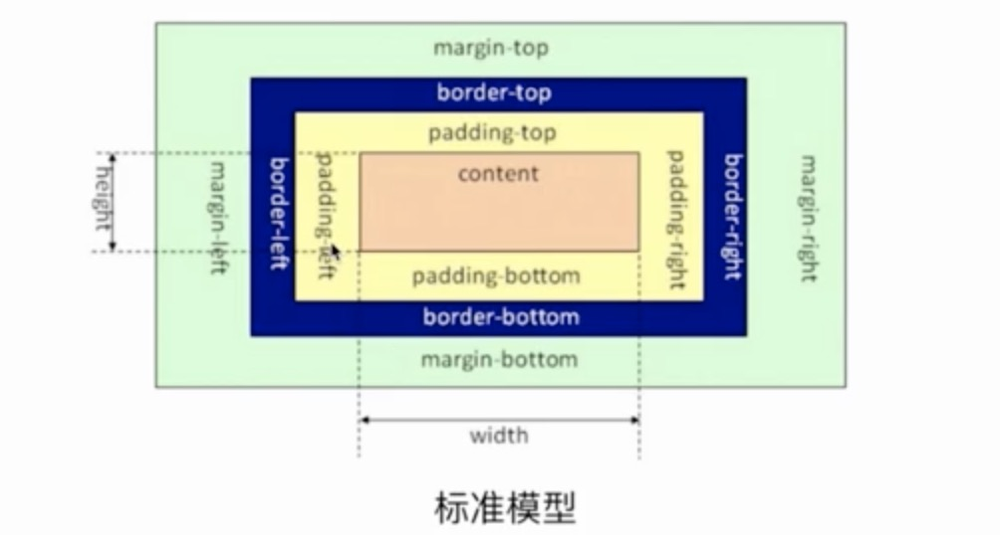

### 基本概念
盒模型组成部分包括 margin、border、padding、content

1. 标准盒模型：
* width 只包含content部分，设置的width = content
* 设置方式：box-sizing: content-box;
2. IE盒模型：
* width 包含border、padding、content，设置width = border+padding+content
* 设置方式：box-sizing: border-box;
### JS如何获取盒模型对应的宽和高
* dom.style.width/height(取出对应dom元素的内联样式的宽和高，但可能不是元素最终占用的宽高)
* window.getComputedStyle(dom).width/height
* dom.getBoundingClientRect().width/height（一般用来获取元素的绝对位置和宽高）
### 根据盒模型解释边距重叠
标准盒模型下：父元素内设置子元素高度为100px和margin-top:10px;父元素高度此时也是100px，父元素会跟着一起margin-top:10px，子元素区域与父元素区域完全重叠
### BFC（Block Formatting Context, 快格式化上下文）
BFC（Block Formatting Context）格式化上下文，是Web页面中盒模型布局的CSS渲染模式，指一个独立的渲染区域或者说是一个隔离的独立容器
#### BFC 触发条件
满足下列条件之一就可触发BFC  
【1】根元素，即HTML元素  
【2】float的值不为none  
【3】overflow的值不为visible  
【4】display的值为inline-block、table、table-cell、table-caption、flex  
【5】position的值为absolute或fixed  
#### BFC 作用：
1. 自适应两栏布局
2. 可以阻止元素被浮动元素覆盖（不会与浮动元素重叠）
3. 可以包含浮动元素-清除内部浮动（清除浮动后，浮动元素就可以参与到高度计算了）
4. 可以阻止margin重叠（父子元素间也会发生margin重叠；空元素的顶部边距与底部边距重叠两者取最大值；同一个BFC内两个相邻块级子元素的上下margin会发生重叠）